# Coding Writer

Coding Writer - консольный помощник для работы с кодом в классе Claude Code и Codex CLI.

Пользователь открывает репозиторий, запускает `cw`, пишет задачу обычным языком, утверждает план и дальше работает в TUI. Приложение само ведёт состояние задачи, применяет безопасные изменения к файлам, запускает разрешённые проверки и показывает понятный результат.

Главное правило: модель не управляет приложением напрямую. Она предлагает план, код, замечания или следующий шаг. Go-код проверяет формат, смысл, правила, безопасные пути, доказательства проверки и только после этого меняет состояние, пишет файлы или запускает команду.

## Архитектура

Один запрос проходит через контролируемую цепочку:

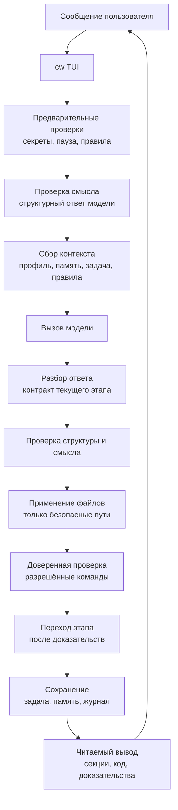

Основные части кода:

- `internal/cli` - команды, обычный чат, вывод для человека и JSON-режим.
- `internal/providers` - вызовы OpenRouter и локальный fake-режим для тестов.
- `internal/prompting` - сбор запроса к модели из профиля, памяти, задачи и правил.
- `internal/memory` - краткая, рабочая и долговременная память.
- `internal/profiles` - пользовательские стили ответа.
- `internal/tasks` - сохранённое состояние задачи.
- `internal/invariants` - устойчивые правила проекта.
- `internal/process` - этапы работы, проверки, обсуждение плана, переходы, доказательства и журнал.
- `internal/storage` - безопасное JSON/JSONL-хранилище с блокировками.

## Состояние задачи

Задача хранит этап, текущий шаг, ожидаемое действие, статус, план, критерии, подзадачи, доказательства проверки и историю.

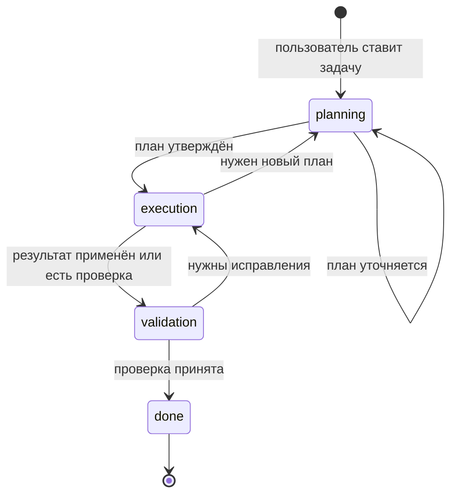

| Этап | Роль модели | Что видит пользователь | Что проверяет приложение |
| --- | --- | --- | --- |
| `planning` | планировщик и роли обсуждения | цель, допущения, критерии, план, замечания ролей | формат плана и подтверждение пользователя |
| `execution` | исполнитель | результат, текущий шаг, следующий шаг | формат результата, безопасные файлы, отсутствие ложных заявлений |
| `validation` | строгий проверяющий | замечания, проверки, недостающие доказательства, вердикт | доверенные доказательства и принятая проверка |
| `done` | итоговый отчёт | финальный статус | завершение с `expected_action=none` |

## Применение файлов

В `execution` модель возвращает файлы в `deliverable`: заголовок файла и fenced code block. Приложение извлекает эти блоки, проверяет путь внутри рабочего репозитория, создаёт каталог и записывает файл.

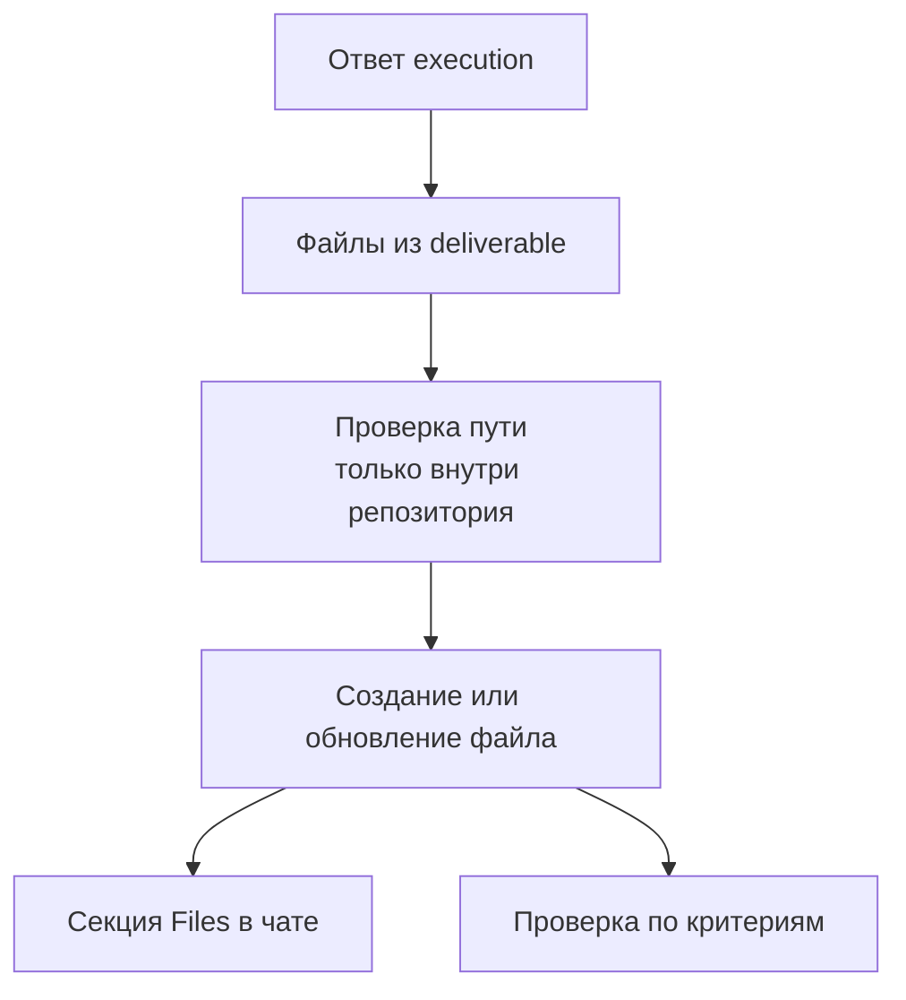

Ограничения:

- запись идёт только внутри рабочего репозитория;
- абсолютные пути, выход через `..` и небезопасные имена блокируются;
- приложение пишет только файлы из структурированного результата текущей задачи;
- после записи пользователь видит секцию `Files`;
- доверенная проверка запускается уже по реальному workspace, а не по тексту ответа.

## Проверка

Пользователь не должен вводить точную команду проверки в обычном сценарии. Приложение берёт проверку из утверждённого плана или критериев. Если точной команды нет, отдельный структурный вызов модели предлагает команду, а локальный код проверяет её безопасность.

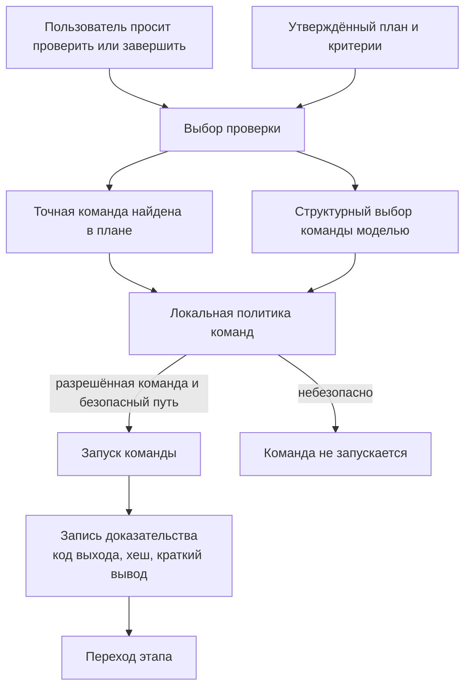

Нельзя угадывать язык по пути, например `Go package path -> go test`. Сначала используется точная команда из утверждённого состояния задачи. `--verify` нужен только для отладки или восстановления, не для основного Day 15 сценария.

## Память

Хранилище задаётся через `--storage-dir` или `ASSISTANT_STORAGE_DIR`. Для демонстрации используется `.assistant/storage/...` внутри репозитория. В обычном режиме данные лежат в пользовательском каталоге приложения.

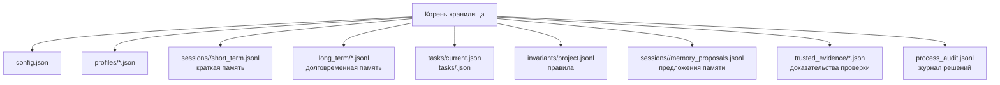

Физические слои памяти:

- `short` - текущая сессия;
- `work` - текущая задача;
- `long` - устойчивые предпочтения, решения и знания.

`ignore` существует только как статус предложения и записи в журнале; отдельного слоя хранения для него нет.

## Интерфейс чата

Обычный интерактивный `cw` открывает TUI в новом пустом chat session. Если есть current task/work, на старте виден только компактный task focus; старые plan/criteria/short/audit/pending proposal не открываются автоматически. К старому чату пользователь возвращается явно через `/resume`, а подробности текущей задачи открывает через `/task`; paused task продолжается отдельно через `/task resume`.

Когда пользователь набирает `/`, TUI сразу показывает список доступных slash-команд и фильтрует его по введённому префиксу. Активные `model` и `profile` видны в header/status; выбор модели через `/model` сохраняется в `config.json` и используется следующими запусками.

Сессия появляется в `/resume` только после первого реального сообщения.
Пустой новый chat не сохраняется как старый чат. Сохранённые сессии показываются
с датой/временем старта и автозаголовком из первого пользовательского
сообщения, чтобы старый чат можно было выбрать без копирования `session_id`.

В TUI пользователь видит задачу, план, planning swarm, переходы, файлы, evidence, warnings и memory proposal в одном рабочем интерфейсе. Audit timeline для старой истории появляется после явного `/resume` или после текущего exchange, а длинные retry/audit серии сворачиваются в компактный summary. `cw --once --input <text>` остаётся one-shot режимом для скриптов и проверок.

В интерактивном терминале stderr показывает прогресс сетевого вызова: когда начался запрос к модели и когда пришёл ответ. JSON-режим остаётся пригодным для скриптов: stdout не загрязняется диагностикой.

В интерактивном терминале заголовки, статусы timeline, stage, severity и decisions подсвечиваются ANSI-стилями. При перенаправлении вывода текст остаётся без escape-кодов, чтобы журналы и тесты читались стабильно.

## День 15

Day 15 доказывает, что это рабочий помощник для кода, а не ручное управление внутренним состоянием. Пользователь работает в одном `cw` TUI; переходы этапов, применение файлов и проверку выполняет приложение.

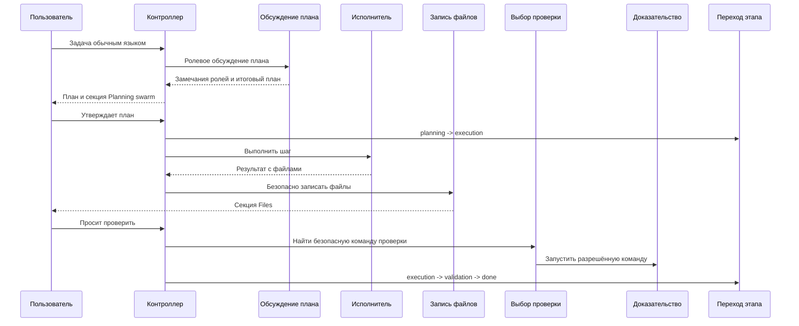

Роли обсуждения плана:

- `requirements_specialist` - неясности, недостающие требования, полнота критериев.
- `code_research_specialist` - файлы, пакеты, API, поверхность изменения.
- `architecture_specialist` - границы модулей, влияние на процесс, поддерживаемость.
- `test_validation_specialist` - покрытие тестами, проверяемые критерии, доказательства.
- `risk_regression_specialist` - регрессии, опасные допущения, ложное завершение.

Вывод для пользователя показывает вклад роли, количество замечаний и предложений, главное замечание и предложенные изменения, если они есть.

## Как работает MCP

MCP в `coding_writer` - это не отдельный режим и не ручной pipeline. Пользователь
подключает один или несколько MCP-серверов, а дальше пишет обычный запрос в `cw`
TUI. Приложение показывает модели только разрешённые tools, принимает tool calls
от модели, маршрутизирует каждый вызов к нужному серверу, проверяет policy и
записывает ordered audit trail.

Главная идея: модель выбирает tool по задаче, но Go-код решает, какие tools
вообще видны модели и можно ли выполнить конкретный вызов.

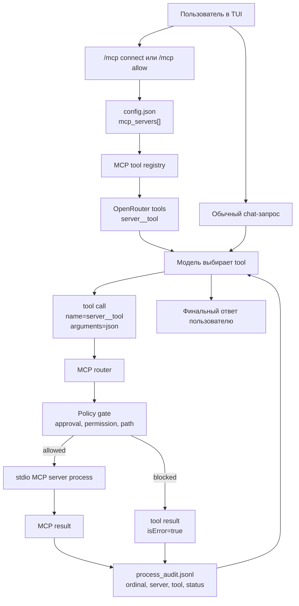

### Что хранится в конфиге

Каждый MCP server хранится в `AppConfig.MCPServers`. Это декларация того, как
запустить сервер и какие tools разрешены.

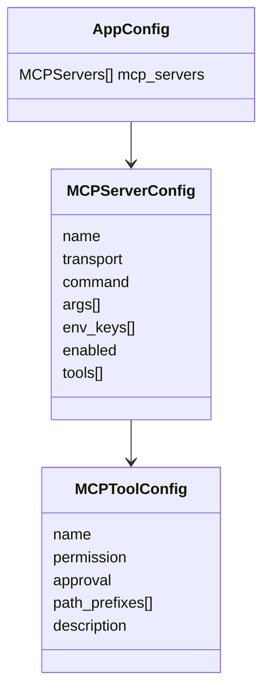

Пример подключения:

```text
/mcp connect github bin:.codingwriter/mcp-bin/github-mcp-server --env GITHUB_PERSONAL_ACCESS_TOKEN --allow search_repositories -- stdio --read-only --toolsets repos
/mcp connect filesystem npm:@modelcontextprotocol/server-filesystem --allow write_file:write:auto:.data/day20 -- .data/day20
```

Что означает эта запись:

- `github` и `filesystem` - имена серверов внутри приложения.
- `bin:` запускает локальный бинарник; `npm:` разворачивается в `npx -y`.
- аргументы после `--` передаются самому MCP server.
- `--env GITHUB_PERSONAL_ACCESS_TOKEN` передаёт только имя переменной; значение
  токена не пишется в config.
- `--allow write_file:write:auto:.data/day20` разрешает tool `write_file`,
  помечает его как write tool, разрешает auto execution и ограничивает путь
  префиксом `.data/day20`.

### Как tools попадают к модели

Перед вызовом модели `appMCPToolRunner.Tools()` проходит по включённым серверам:

1. стартует configured stdio MCP server;
2. выполняет `initialize`;
3. запрашивает `list_tools`;
4. оставляет только tools из allowlist;
5. отдаёт модели function tools с именами вида `server__tool`.

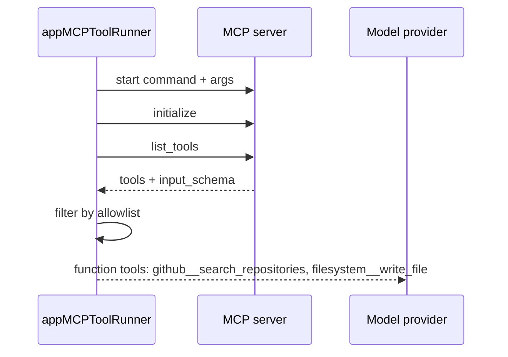

Имена tools специально namespaced. Если два сервера имеют tool `search`, модель
всё равно видит разные функции: `github__search` и `docs__search`.

### Как выбирается сервер

Маршрутизация полностью определяется именем tool call:

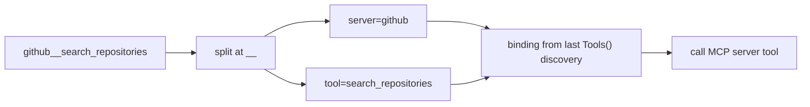

Модель не передаёт имя server отдельным полем. Она выбирает функцию
`server__tool`, а приложение находит binding, созданный на этапе discovery.
Если binding отсутствует или tool не allowlisted, модель получает tool result с
ошибкой, а не прямой доступ к серверу.

### Policy gate

Перед реальным `call_tool` выполняется локальная policy проверка.

| Поле | Значения | Что делает |
| --- | --- | --- |
| `approval` | `auto`, `ask`, `deny` | `auto` выполняется; `ask` пока блокируется как требующий явного подтверждения; `deny` скрывает или запрещает tool |
| `permission` | `read`, `browser`, `write` | классифицирует риск tool |
| `path_prefixes` | список путей | обязателен для `write`; ограничивает целевой путь |

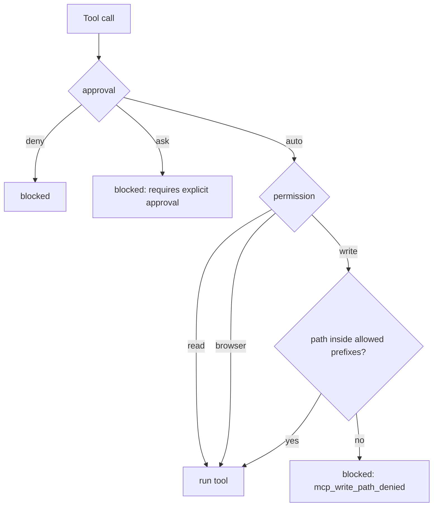

Для write tools приложение ищет path-like argument (`path`, `file`, `filename`
и похожие поля) и проверяет, что путь остаётся внутри разрешённых префиксов.
Поэтому filesystem MCP может сохранить `.data/day20/multi-mcp-report.md`, но не
может писать произвольные файлы репозитория, если это не разрешено policy.

### Длинный flow через несколько серверов

Day 20 демонстрирует именно orchestration: один обычный запрос приводит к
цепочке вызовов на разных MCP-серверах.

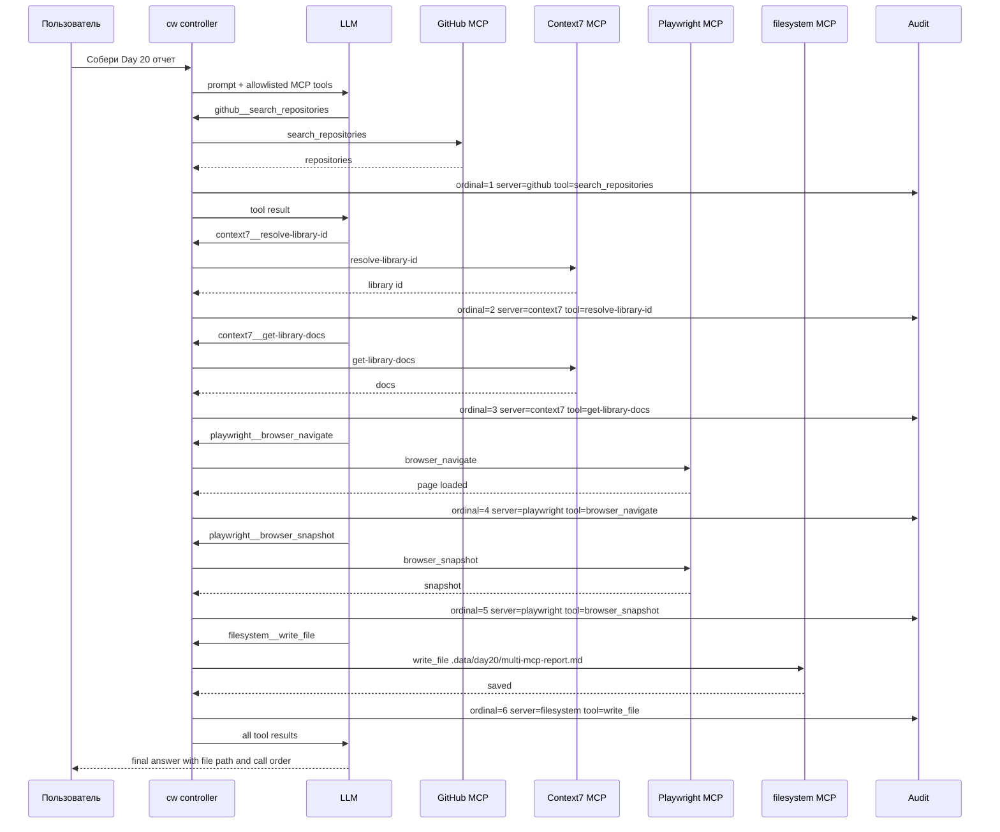

Каждый call/result попадает в `process_audit.jsonl`. В TUI эти события видны как
цветные `mcp` события, а в следующих запросах same-session MCP audit evidence
добавляется в prompt как trusted context. Это позволяет спросить после flow:
`какие MCP tools ты использовал?` - и модель отвечает по audit evidence, а не по
догадке.

### Что видит пользователь

`/mcp` показывает компактный список серверов и разрешённых tools:

```text
mcp servers:
  github       enabled  stdio  cmd=github-mcp-server args=4
    search_repositories      read    auto
  context7     enabled  stdio  cmd=npx args=2
    resolve-library-id       read    auto
    get-library-docs         read    auto
  playwright   enabled  stdio  cmd=npx args=6
    browser_navigate         browser auto
    browser_snapshot         browser auto
  filesystem   enabled  stdio  cmd=npx args=3
    write_file               write   auto paths=.data/day20
help: /mcp connect | /mcp tools <server> | /mcp allow | /mcp call | /mcp remove
```

Это не подсказка модели, какие tools вызвать. Это user-facing состояние
подключений: какие серверы включены, какие tools allowlisted, какие permissions
и path gates активны.

## Приёмочные дни

Day 11: память разделена на `short`, `work`, `long`; модель предлагает, что сохранить, пользователь подтверждает.

Day 12: активный профиль влияет на каждый запрос; разные профили дают разные стили ответа.

Day 13: задача хранит этап, текущий шаг и ожидаемое действие; pause/resume сохраняет состояние.

Day 14: правила проекта хранятся отдельно, видны модели в запросе и проверяются до сохранения результата.

Day 15: весь основной путь идёт через один обычный чат; приложение управляет этапами, файлами и проверкой.

Day 18: scheduled MCP flow связывает `coding_writer` с отдельным
`/Users/nikita/Documents/mcp-server`. MCP server в первом терминале работает как
фоновой GitHub monitor: по расписанию читает public GitHub API, пишет
JSON/JSONL evidence и обновляет aggregate summary. `cw` во втором терминале
запускает LLM-agent loop: периодически вызывает read-only MCP tool, передаёт
aggregate в активную модель и печатает человеческую сводку. Интервал agent loop
по умолчанию редкий (`2m`), чтобы медленная LLM успевала ответить без
наложения запросов.

Этот блок ниже — legacy CLI helper/smoke для Day 18. Он не является шаблоном
для новых user-facing homework demos: основной acceptance proof должен идти
через обычный `cw` TUI.

```bash
# terminal 1
cd /Users/nikita/Documents/mcp-server
python3 server.py worker --storage-dir .data/day18 --repo nikbrik/coding_writer --interval 5s --demo

# terminal 2
cd /Users/nikita/code/coding_writer
cw mcp add day18-github-watch \
  --command python3 \
  --arg /Users/nikita/Documents/mcp-server/server.py \
  --arg --storage-dir \
  --arg /Users/nikita/Documents/mcp-server/.data/day18 \
  --allow-tool github_watch_status \
  --allow-tool github_watch_summary \
  --allow-tool github_watch_history \
  --auto-approve \
  --read-only

cw mcp watch-agent day18-github-watch github_watch_summary
```

Day 19: chain from one MCP server в обычном тексте (без `pipeline-agent`)

В одном запросе `cw chat`/TUI:

```bash
Найди GitHub репозитории про mcp server python, сделай короткий отчет и сохрани его в файл.
```

LLM сам должен вызвать последовательно:
`github_search_repos` → `github_make_report` → `save_report_to_file`.

Демонстрационный setup через TUI. Отдельно запускать `server.py` не нужно:
`cw` сам стартует stdio MCP server из `--command` и `--arg`.

```bash
cd /Users/nikita/code/coding_writer
export ASSISTANT_STORAGE_DIR=/Users/nikita/code/coding_writer/.assistant/day19-manual
cw init --model google/gemini-3.1-flash-lite
cw
```

Внутри TUI сначала зарегистрируйте MCP server slash-командой:

```text
/mcp add day19-github-tools --command python3 --arg /Users/nikita/Documents/mcp-server/server.py --arg --storage-dir --arg /Users/nikita/Documents/mcp-server/.data/day19 --allow-tool github_search_repos --allow-tool github_make_report --allow-tool save_report_to_file --auto-approve
```

Проверьте tools прямо в TUI:

```text
/mcp tools day19-github-tools
```

Затем в том же TUI отправьте обычный текстовый запрос:

```text
Найди GitHub репозитории про mcp server python, сделай короткий отчет и сохрани его в файл.
```

Если нужен второй терминал для наглядного наблюдения, откройте его после
запуска запроса и смотрите persisted events:

```bash
tail -f /Users/nikita/Documents/mcp-server/.data/day19/pipeline_runs.jsonl
```

Проверяем подтверждение:

- `process_audit.jsonl` содержит 3 пары `mcp_tool_call`/`mcp_tool_result` для `search -> report -> save`.
- ассистентный ответ содержит путь:
  `/Users/nikita/Documents/mcp-server/.data/day19/output/report_<id>.md`.
- файл существует и не пустой.

Day 20: orchestration across several existing MCP servers in one ordinary TUI
chat. The detailed plan, policies, and evidence checklist are in
[`docs/day20-multi-mcp-orchestration-plan.md`](docs/day20-multi-mcp-orchestration-plan.md).

Demo setup uses popular existing servers:

- GitHub MCP for public repo metadata.
- Context7 MCP for current library docs.
- Playwright MCP for browser/page inspection.
- filesystem MCP for saving the final report.

```bash
cd /Users/nikita/code/coding_writer
export ASSISTANT_STORAGE_DIR=/Users/nikita/code/coding_writer/.assistant/day20-manual
export ASSISTANT_MODEL=google/gemini-3.1-flash-lite
export GITHUB_PERSONAL_ACCESS_TOKEN=...
mkdir -p .data/day20/playwright
cw init --model "$ASSISTANT_MODEL"
cw
```

Install the official GitHub MCP server once if the repo-local binary is missing:

```bash
mkdir -p .codingwriter/mcp-bin
GOBIN=/Users/nikita/code/coding_writer/.codingwriter/mcp-bin \
  go install github.com/github/github-mcp-server/cmd/github-mcp-server@latest
```

Connect MCP servers inside the same TUI session using the generic shorthand:

```text
/mcp connect github bin:.codingwriter/mcp-bin/github-mcp-server --env GITHUB_PERSONAL_ACCESS_TOKEN --allow search_repositories -- stdio --read-only --toolsets repos
/mcp connect context7 npm:@upstash/context7-mcp --allow resolve-library-id,get-library-docs
/mcp connect playwright npm:@playwright/mcp --allow browser_navigate:browser,browser_snapshot:browser -- --headless --isolated --output-dir .data/day20/playwright
/mcp connect filesystem npm:@modelcontextprotocol/server-filesystem --allow write_file:write:auto:.data/day20 -- .data/day20
/mcp
```

`/mcp connect` is generic: `npm:` expands to `npx -y`, `bin:` runs a local
binary, and `cmd:` runs a command from `PATH`. Server-specific args go after
`--`. Compact `--allow` specs use
`tool[:permission[:approval[:path-prefix]]]`.

If a new MCP server's tools are unknown, connect it first without `--allow`,
inspect tools, then allow only the tools the agent may use:

```text
/mcp connect docs npm:@vendor/example-mcp
/mcp tools docs
/mcp allow docs search --permission read --approval auto
```

For the ready-made Day 20 setup, `/mcp preset day20` remains available as a
shortcut. Raw `/mcp add` remains available as a low-level escape hatch.

Then send a normal chat message, not a pipeline command:

```text
Собери Day 20 отчет о популярных MCP-серверах для coding agent.

Нужны 4 типа evidence: репозитории, документация, браузерная проверка страницы проекта и сохраненный markdown-файл .data/day20/multi-mcp-report.md.

В конце покажи путь к файлу и фактический порядок вызванных инструментов.
```

Проверяем подтверждение:

- `process_audit.jsonl` содержит ordered MCP trace с `ordinal`, `server`,
  `tool`, `status` и summary результата.
- TUI показывает MCP tool call/result события в порядке:
  GitHub -> Context7 -> Playwright -> filesystem.
- `.data/day20/multi-mcp-report.md` существует и создан через filesystem MCP.
- write tool явно разрешен через `/mcp allow`; запись вне `.data/day20`
  блокируется policy gate.

## Запуск

Сборка локального бинарника:

```bash
mkdir -p .codingwriter/bin
scripts/build-cw.sh
export PATH="$PWD/.codingwriter/bin:$PATH"
cw --version
```

Версия берётся из файла `VERSION` в формате `x.y.z`. Перед заметными правками
увеличивайте `VERSION`, затем запускайте `scripts/build-cw.sh`: в бинарник
попадут SemVer, git commit и UTC build time.

Инициализация:

```bash
test -n "$OPENROUTER_API_KEY" && echo "OPENROUTER_API_KEY set"
cw init --model "google/gemini-3.1-flash-lite"
cw
```

Live-сценарий Day 15:

```bash
test -n "$OPENROUTER_API_KEY" && echo "OPENROUTER_API_KEY set"
scripts/day15-demo.sh
```

Локальная репетиция без OpenRouter:

```bash
scripts/day15-demo.sh --fake
```

Автоматическая проверка регрессий без OpenRouter:

```bash
scripts/day15-demo.sh --fake --auto
```

Подробные ручные сценарии находятся в [docs/manual-testing-demo.md](docs/manual-testing-demo.md). Day 15 live-сценарий хранится только там, чтобы не было второго источника правды.

## Проверка разработки

Основные команды:

```bash
go test ./...
go test ./internal/cli ./internal/process ./internal/tasks ./manual_scratch/day15_contains_duplicate
git diff --check
```

Если `go test ./...` в песочнице не может открыть локальный порт для `httptest`, тесты провайдера нужно запускать вне песочницы с тем же кодом и теми же переменными окружения.
