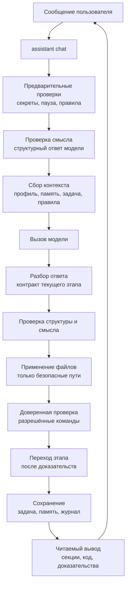
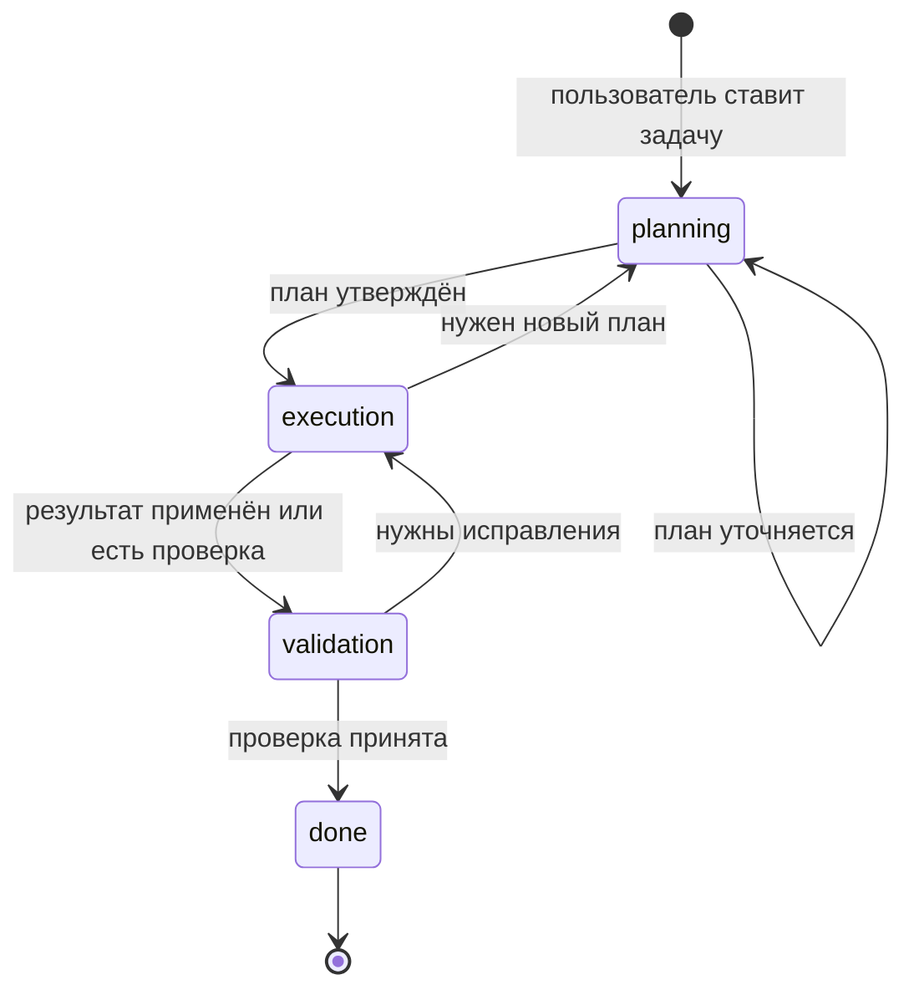
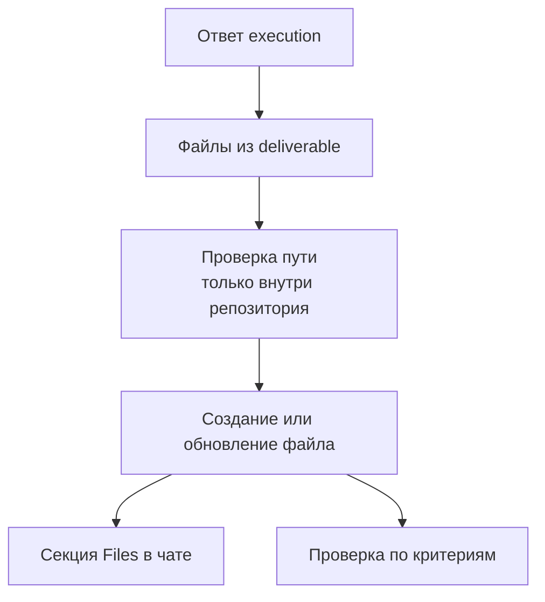
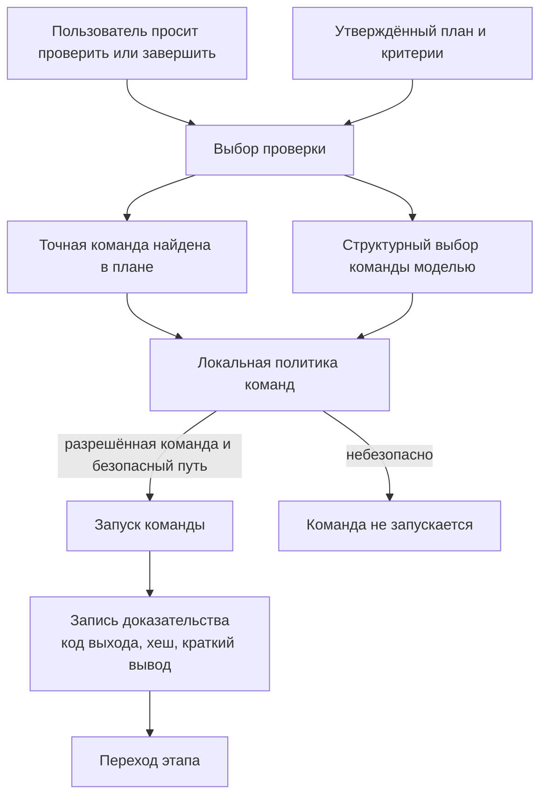
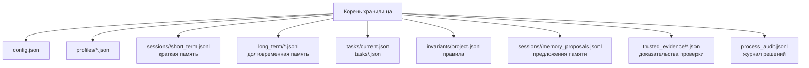
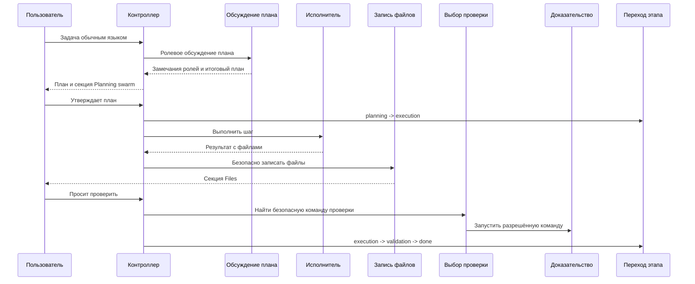

# Coding Writer

Coding Writer - консольный помощник для работы с кодом в классе Claude Code и Codex CLI.

Пользователь открывает репозиторий, запускает `assistant chat`, пишет задачу обычным языком, утверждает план и дальше общается в том же чате. Приложение само ведёт состояние задачи, применяет безопасные изменения к файлам, запускает разрешённые проверки и показывает понятный результат.

Главное правило: модель не управляет приложением напрямую. Она предлагает план, код, замечания или следующий шаг. Go-код проверяет формат, смысл, правила, безопасные пути, доказательства проверки и только после этого меняет состояние, пишет файлы или запускает команду.

## Архитектура

Один запрос проходит через контролируемую цепочку:



Основные части кода:

- `internal/cli` - команды, обычный чат, вывод для человека и JSON-режим.
- `internal/providers` - вызовы OpenRouter и локальный fake-режим для тестов.
- `internal/prompting` - сбор запроса к модели из профиля, памяти, задачи и правил.
- `internal/memory` - краткая, рабочая и долговременная память.
- `internal/profiles` - пользовательские стили ответа.
- `internal/tasks` - сохранённое состояние задачи.
- `internal/invariants` - устойчивые правила проекта.
- `internal/process` - этапы работы, проверки, обсуждение плана, переходы, доказательства и журнал.
- `internal/storage` - безопасное JSON/JSONL-хранилище с блокировками.

## Состояние задачи

Задача хранит этап, текущий шаг, ожидаемое действие, статус, план, критерии, подзадачи, доказательства проверки и историю.



| Этап | Роль модели | Что видит пользователь | Что проверяет приложение |
| --- | --- | --- | --- |
| `planning` | планировщик и роли обсуждения | цель, допущения, критерии, план, замечания ролей | формат плана и подтверждение пользователя |
| `execution` | исполнитель | результат, текущий шаг, следующий шаг | формат результата, безопасные файлы, отсутствие ложных заявлений |
| `validation` | строгий проверяющий | замечания, проверки, недостающие доказательства, вердикт | доверенные доказательства и принятая проверка |
| `done` | итоговый отчёт | финальный статус | завершение с `expected_action=none` |

## Применение файлов

В `execution` модель возвращает файлы в `deliverable`: заголовок файла и fenced code block. Приложение извлекает эти блоки, проверяет путь внутри рабочего репозитория, создаёт каталог и записывает файл.



Ограничения:

- запись идёт только внутри рабочего репозитория;
- абсолютные пути, выход через `..` и небезопасные имена блокируются;
- приложение пишет только файлы из структурированного результата текущей задачи;
- после записи пользователь видит секцию `Files`;
- доверенная проверка запускается уже по реальному workspace, а не по тексту ответа.

## Проверка

Пользователь не должен вводить точную команду проверки в обычном сценарии. Приложение берёт проверку из утверждённого плана или критериев. Если точной команды нет, отдельный структурный вызов модели предлагает команду, а локальный код проверяет её безопасность.



Нельзя угадывать язык по пути, например `Go package path -> go test`. Сначала используется точная команда из утверждённого состояния задачи. `--verify` нужен только для отладки или восстановления, не для основного Day 15 сценария.

## Память

Хранилище задаётся через `--storage-dir` или `ASSISTANT_STORAGE_DIR`. Для демонстрации используется `.assistant/storage/...` внутри репозитория. В обычном режиме данные лежат в пользовательском каталоге приложения.



Физические слои памяти:

- `short` - текущая сессия;
- `work` - текущая задача;
- `long` - устойчивые предпочтения, решения и знания.

`ignore` существует только как статус предложения и записи в журнале; отдельного слоя хранения для него нет.

## Интерфейс чата

Обычный `assistant chat` и `assistant chat --once --input <text>` выводят понятный текст, а не сырой JSON. Пользователь видит секции `Assistant`, `Planning swarm`, `Task`, `Transition`, `Files`, `Evidence`, `Warnings`, `Memory proposal` и `Next`.

В интерактивном терминале stderr показывает прогресс сетевого вызова: когда начался запрос к модели и когда пришёл ответ. JSON-режим остаётся пригодным для скриптов: stdout не загрязняется диагностикой.

В интерактивном терминале заголовки, подписи и Go code blocks подсвечиваются ANSI-стилями. При перенаправлении вывода текст остаётся без escape-кодов, чтобы журналы и тесты читались стабильно.

## День 15

Day 15 доказывает, что это рабочий помощник для кода, а не ручное управление внутренним состоянием. Пользователь работает в одном `assistant chat`; переходы этапов, применение файлов и проверку выполняет приложение.



Роли обсуждения плана:

- `requirements_specialist` - неясности, недостающие требования, полнота критериев.
- `code_research_specialist` - файлы, пакеты, API, поверхность изменения.
- `architecture_specialist` - границы модулей, влияние на процесс, поддерживаемость.
- `test_validation_specialist` - покрытие тестами, проверяемые критерии, доказательства.
- `risk_regression_specialist` - регрессии, опасные допущения, ложное завершение.

Вывод для пользователя показывает вклад роли, количество замечаний и предложений, главное замечание и предложенные изменения, если они есть.

## Приёмочные дни

Day 11: память разделена на `short`, `work`, `long`; модель предлагает, что сохранить, пользователь подтверждает.

Day 12: активный профиль влияет на каждый запрос; разные профили дают разные стили ответа.

Day 13: задача хранит этап, текущий шаг и ожидаемое действие; pause/resume сохраняет состояние.

Day 14: правила проекта хранятся отдельно, видны модели в запросе и проверяются до сохранения результата.

Day 15: весь основной путь идёт через один обычный чат; приложение управляет этапами, файлами и проверкой.

## Запуск

Сборка локального бинарника:

```bash
mkdir -p .assistant/bin
go build -o .assistant/bin/assistant ./cmd/assistant
export PATH="$PWD/.assistant/bin:$PATH"
```

Инициализация:

```bash
export OPENROUTER_API_KEY="..."
assistant init --model "google/gemini-3.1-flash-lite"
assistant chat
```

Live-сценарий Day 15:

```bash
export OPENROUTER_API_KEY="..."
scripts/day15-demo.sh
```

Локальная репетиция без OpenRouter:

```bash
scripts/day15-demo.sh --fake
```

Автоматическая проверка регрессий без OpenRouter:

```bash
scripts/day15-demo.sh --fake --auto
```

Подробные ручные сценарии находятся в [docs/manual-testing-demo.md](docs/manual-testing-demo.md). Day 15 live-сценарий хранится только там, чтобы не было второго источника правды.

## Проверка разработки

Основные команды:

```bash
go test ./...
go test ./internal/cli ./internal/process ./internal/tasks ./manual_scratch/day15_contains_duplicate
git diff --check
```

Если `go test ./...` в песочнице не может открыть локальный порт для `httptest`, тесты провайдера нужно запускать вне песочницы с тем же кодом и теми же переменными окружения.
