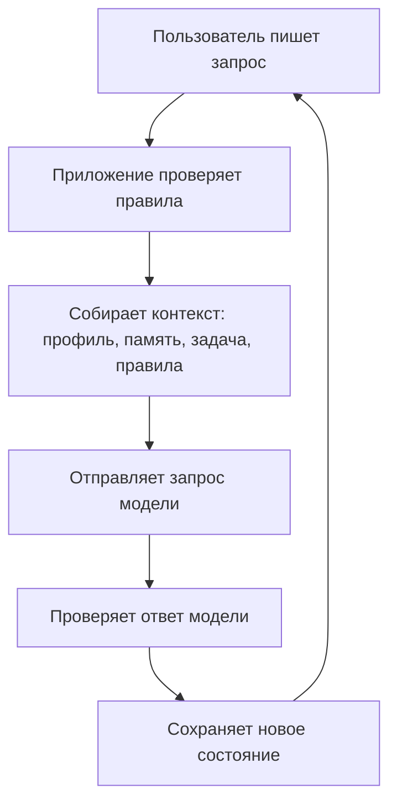
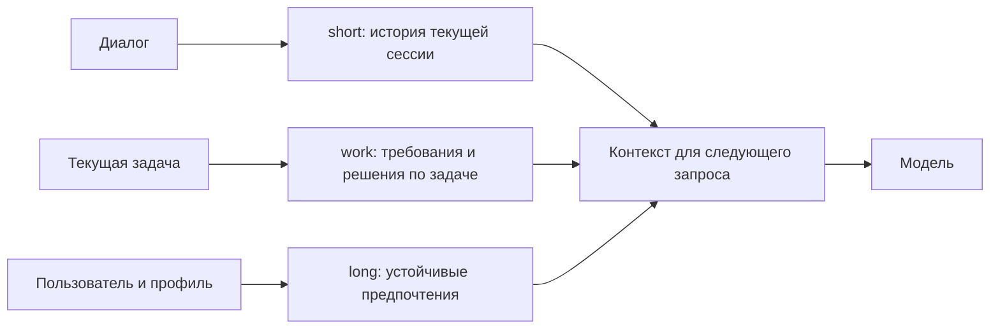
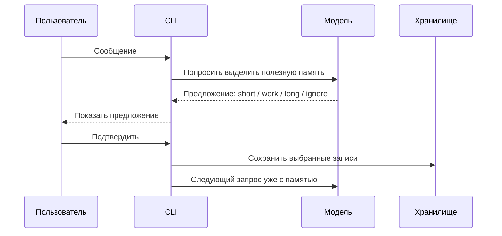
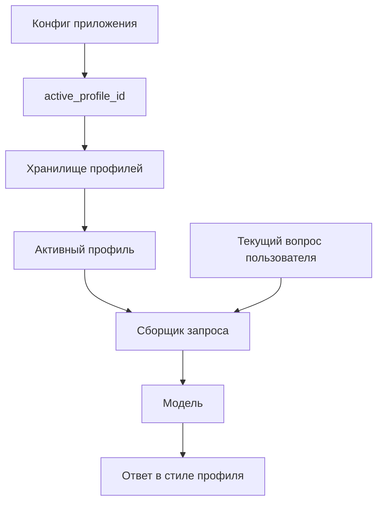
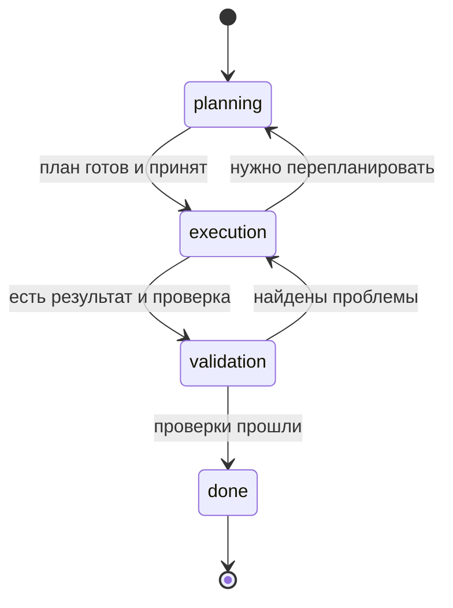
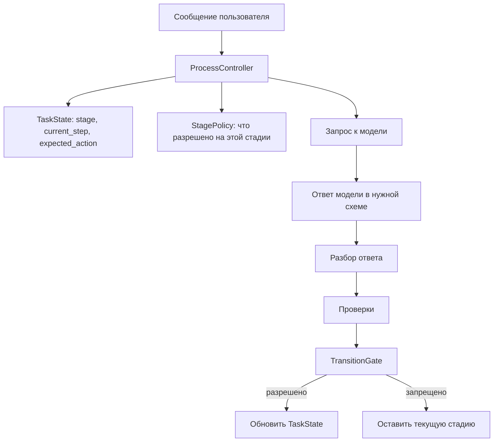
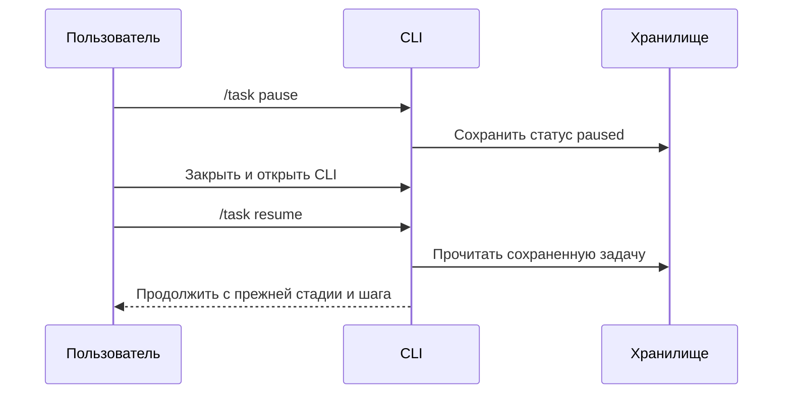
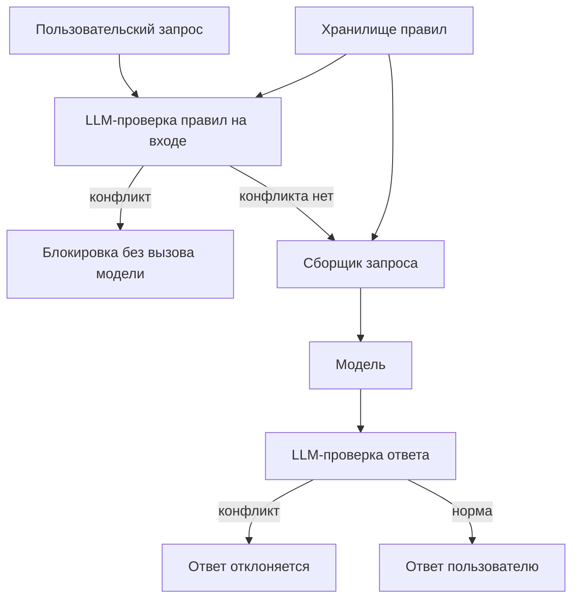

# Coding Writer

Coding Writer - это CLI-помощник для задач по коду.

Он умеет вести диалог, помнить контекст, менять стиль ответа, вести задачу по стадиям и проверять постоянные правила проекта. Главное: модель не управляет приложением сама. Она отвечает в заданном формате, а приложение проверяет ответ и только потом сохраняет новое состояние.

## Общая идея

Обычный запрос проходит такой путь:



В приложении есть несколько важных частей:

- память - хранит полезный контекст;
- профили - задают стиль ответа;
- задача по стадиям - помогает доводить работу до конца;
- постоянные правила - блокируют запросы, которые противоречат проекту;
- проверка результата - не дает завершить задачу без надежного подтверждения.

Проверки идут в двух местах. Модель возвращает структурированный JSON там, где приложению нужно принять решение. Затем Go-код разбирает этот JSON строго: лишние поля, неверная стадия или пустые обязательные поля считаются ошибкой. Для смысловых решений, например "пользователь правда одобрил переход дальше или просто обсуждает его" или "запрос реально нарушает правило проекта", используется отдельный LLM-валидатор. Локально приложение оставляет hard gates: секреты, некорректный JSON, небезопасные id, отсутствие обязательных полей и fallback для режимов без LLM-валидатора.

Подробный сценарий ручной демонстрации лежит в [docs/manual-testing-day11-14.md](docs/manual-testing-day11-14.md).

## День 11: память

Критерии Дня 11 закрывает система памяти. Она нужна, чтобы приложение не начинало каждый запрос с нуля и могло использовать уже принятый контекст.

Память разделена на 3 слоя:

- `short` - текущий диалог;
- `work` - требования текущей задачи;
- `long` - устойчивые предпочтения пользователя.

Архитектурно это выглядит так:



Как это работает:

- короткая история диалога сохраняется сразу как `short`;
- полезные факты для задачи попадают в `work`;
- постоянные предпочтения попадают в `long`;
- случайный шум не должен попадать в полезную память.

Классификацию делает модель, но не свободным текстом. Она должна вернуть JSON со списком записей: слой, тип записи, содержание, причина и уверенность. Приложение строго парсит этот JSON, отбрасывает неизвестные слои, блокирует секреты и дополнительно переносит требования активной задачи из `long` в `work`, если модель ошиблась с областью.

Запись важной памяти проходит через предложение:



Важно: память не записывается молча. Для долгой памяти нужен видимый шаг с предложением и явное подтверждение пользователя.

Ключевой паттерн: модель может предложить, но решение о записи принимает приложение вместе с пользователем. Поэтому память остается управляемой.

Команды для проверки в CLI:

```bash
/memory propose
/memory apply --accept all
/memory short
/memory work
/memory long
```

В коде это проверяет тест:

```bash
go test ./tests -run TestDay11
```

## День 12: профили

Критерии Дня 12 закрывает система профилей. Она отделяет стиль ответа от текста задачи.

Профиль отвечает за стиль. Один и тот же вопрос может звучать по-разному, если активен другой профиль.

Примеры профилей:

- `student` - объясняет подробнее, как преподаватель;
- `senior` - отвечает короче, с фокусом на решение и риски;
- свой профиль - можно создать под нужный стиль.

Профиль хранится отдельно от диалога и добавляется в контекст запроса:



То есть пользователю не нужно каждый раз писать "объясняй как преподаватель" или "отвечай кратко". Достаточно выбрать профиль.

Что есть внутри профиля:

- язык и тон ответа;
- уровень подробности;
- формат ответа;
- ограничения, например "показывать reasoning" или "фокусироваться на рисках".

Профиль проверяет само приложение. У профиля должен быть безопасный `id`, непустое имя, стиль, формат ответа и ограничения. Секреты нельзя сохранять ни в названии, ни в настройках профиля. Модель здесь ничего не валидирует: она только получает уже выбранный профиль в составе контекста.

Ключевой паттерн: стиль не размазан по пользовательским запросам. Он хранится как отдельная настройка, проверяется при сохранении и автоматически попадает в запрос к модели.

Примеры команд:

```bash
assistant profiles list
assistant profiles show student
assistant profiles show senior
```

В интерактивном чате:

```text
/profile student
Объясни подход к Valid Parentheses.

/profile senior
Объясни подход к Valid Parentheses.
```

В коде это проверяет тест:

```bash
go test ./tests -run TestDay12
```

## День 13: задача по стадиям

Критерии Дня 13 закрывает система ведения задачи. Она нужна, чтобы работа не превращалась в свободный чат без состояния.

У задачи есть стадии:



Простыми словами:

- `planning` - составляем план;
- `execution` - даем решение;
- `validation` - проверяем результат;
- `done` - задача завершена.

Приложение хранит не только стадию, но и текущий шаг, ожидаемое действие и историю. Поэтому задачу можно остановить и продолжить позже.

Главная идея: стадией владеет приложение, а не модель.



Переходы не делаются просто потому, что модель так написала. Приложение проверяет:

- ответ относится к текущей стадии;
- ответ имеет нужную структуру;
- переход разрешен;
- для завершения есть надежное подтверждение, например результат `go test`.

Здесь несколько уровней проверки:

- `ResponseParser` разбирает ответ модели как строгий JSON для текущей стадии;
- stage validators проверяют обязательные поля и простые запреты в Go-коде;
- `SemanticValidator` отдельно спрашивает модель-валидатор о смысле ответа и получает строгий JSON `pass` или `fail`;
- `TransitionGate` проверяет, можно ли менять стадию именно из текущего состояния;
- trusted verification добавляется только приложением, например через `--verify "go test ..."`, а не со слов модели.

Например, в `execution` модель может дать код в `deliverable`, но не может сама заявить "тесты прошли", если приложение не передало результат команды как trusted evidence. В `validation` переход в `done` запрещен, если нет проверок, есть blocker/high finding или отсутствует trusted evidence.

В `TaskState` хранятся:

- стадия;
- текущий шаг;
- завершенные шаги;
- ожидаемое действие;
- критерии готовности;
- план;
- история изменений.

Pause/resume:



После `resume` приложение восстанавливает задачу из сохраненного состояния и продолжает с того же места.

Ключевой паттерн: модель помогает с содержанием, но переходы между стадиями проходят через проверяемые правила приложения.

В коде это проверяет тест:

```bash
go test ./tests -run TestDay13
```

## День 14: постоянные правила

Критерии Дня 14 закрывает система постоянных правил.

В коде они называются `invariants`. Проще говоря, это правила, которые приложение обязано соблюдать всегда.

Пример правила:

```text
MVP написан на Go + Cobra.
Не предлагать переписать P0 на Python, Node или Rust.
```

Правила хранятся отдельно от диалога и задачи:



Важно: конфликтный запрос блокируется до отправки модели. Например, если пользователь просит переписать Go MVP на Python, приложение вернет ошибку правила и не вызовет модель.

После отказа обычный безопасный запрос продолжает работать. Отказ не ломает текущую задачу и не портит состояние.

Что хранится в правиле:

- `id` - имя правила;
- `scope` - область, например `stack`, `memory`, `security`;
- `content` - человеческое описание правила;
- `severity` - насколько строго правило;
- `forbidden_terms` - примеры и fallback-сигналы для правила.

Валидация правил сделана через отдельный LLM-вызов со строгим JSON-ответом. Этот вызов работает как судья: получает текст, список активных правил и возвращает список нарушений. `forbidden_terms` остаются подсказками и fallback-сигналами, но не являются основным способом понять смысл запроса. Поэтому вопрос "почему нельзя переписать MVP на Python?" можно разрешить, а просьбу "перепиши MVP на Python" заблокировать.

Если найден конфликт на входе, обычный chat provider не вызывается. Если конфликт появился в ответе модели, ответ отклоняется до сохранения в память.

Ключевой паттерн: важные ограничения живут не в памяти и не в профиле. Они хранятся как отдельная политика, которую приложение проверяет до и после обращения к модели.

Примеры команд:

```bash
assistant invariants list --json
assistant invariants add algorithm.no_bruteforce --kind quality --content "For stock-profit tasks, do not propose brute-force O(n^2); use one-pass O(n)." --forbid "O(n^2)" --forbid "brute force"
```

В коде это проверяет тест:

```bash
go test ./tests -run TestDay14
```

## Как собрать и запустить

Сборка CLI:

```bash
go build -o .assistant/bin/assistant ./cmd/assistant
```

Добавить бинарник в `PATH` для текущего терминала:

```bash
export PATH="$PWD/.assistant/bin:$PATH"
```

Инициализация:

```bash
assistant init --model "$ASSISTANT_MODEL"
```

Интерактивный чат:

```bash
assistant chat
```

Для отдельной демонстрации удобно задавать отдельную папку состояния:

```bash
export ASSISTANT_STORAGE_DIR="$PWD/.assistant/storage/demo"
```

Так разные прогоны не смешивают память, профили, задачи и правила.

## Как проверить

Проверить дни 11-14:

```bash
go test ./tests -run 'TestDay11|TestDay12|TestDay13|TestDay14'
```

Проверить весь проект:

```bash
go test ./...
```

## Где читать дальше

- [docs/manual-testing-day11-14.md](docs/manual-testing-day11-14.md) - подробный сценарий демонстрации дней 11-14;
- [docs/prd.md](docs/prd.md) - описание продукта;
- [docs/frd.md](docs/frd.md) - функциональные требования;
- [docs/architect.md](docs/architect.md) - архитектурные заметки.
