# Coding Writer

Coding Writer - terminal-first AI coding agent CLI в том же продуктовом классе, что Claude Code и Codex CLI.

Целевая модель: разработчик открывает репозиторий, запускает `assistant chat`, пишет задачу обычным языком, а ассистент планирует работу, ведёт task lifecycle, использует память/профиль/правила, запускает безопасную проверку, показывает evidence и доводит задачу до результата в одном chat flow.

Текущий P0 - это control-plane такого агента. Он уже реализует диалог, память, профили, task state, stage policies, semantic validators, planning swarm, trusted verification, audit и human-readable terminal output. Полноценные repo tools для чтения/редактирования файлов, shell execution, diff review and recovery - следующий слой P1/P2; они должны встраиваться в тот же chat-first lifecycle, а не становиться отдельной debug-утилитой.

Главный принцип: LLM не владеет приложением. Модель может предложить план, код, findings или transition signal, но Go-код проверяет схему, смысл, правила, evidence и только потом меняет состояние или запускает разрешённую проверку.

## Architecture

### Runtime Flow

Обычный запрос проходит через контролируемый pipeline:

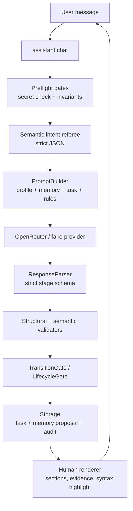

Ключевые компоненты:

- `internal/cli` - Cobra commands, REPL, slash commands, human/JSON rendering;
- `internal/providers` - OpenRouter and fake provider;
- `internal/prompting` - prompt assembly from profile, memory, task and invariants;
- `internal/memory` - short/work/long memory and proposal workflow;
- `internal/profiles` - user style profiles;
- `internal/tasks` - persisted task FSM;
- `internal/invariants` - durable project rules;
- `internal/process` - process controller, stage policies, validators, planning swarm, lifecycle gate, evidence store and audit;
- `internal/storage` - JSON/JSONL file storage with locks;
- `manual_scratch/*` and `tests/*` - acceptance/demo tasks.

### Storage Model

Storage root задаётся `--storage-dir` или `ASSISTANT_STORAGE_DIR`. Для demo используется repo-local `.assistant/storage/...`; обычный default идёт через user config dir.

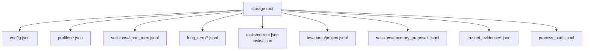

Физические memory layers только три:

- `short` - текущая сессия;
- `work` - текущая задача;
- `long` - устойчивые предпочтения, решения, знания.

`ignore` существует только как proposal/audit status; это не storage layer.

### Task Lifecycle

Task state хранит `stage`, `current_step`, `expected_action`, `status`, план, критерии, microtasks, validation evidence and history.

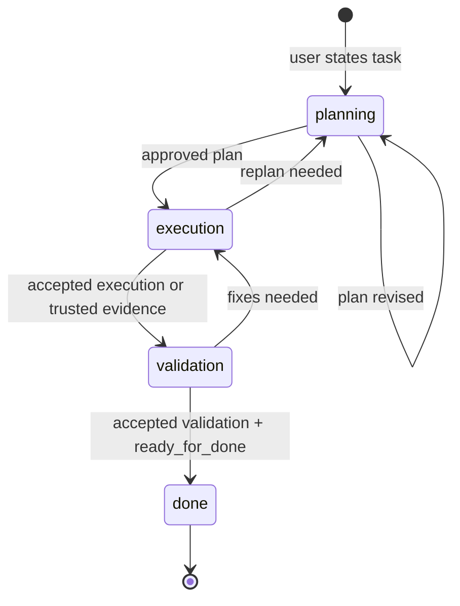

Allowed stage ownership:

| Stage | LLM role | User sees | App gate |
| --- | --- | --- | --- |
| `planning` | planner + planning swarm | summary, assumptions, criteria, plan, swarm review | plan schema + approval validation |
| `execution` | implementer | deliverable, current step, next step | execution schema + no false tool claims |
| `validation` | strict reviewer | findings, checks, missing evidence, verdict | trusted evidence + accepted validation |
| `done` | summarizer | final status | terminal `expected_action=none` |

### Day 15 Control Plane

Day 15 is the main proof that this is a coding-agent workflow, not manual FSM driving. The user works in one `assistant chat`; application code owns state transitions.

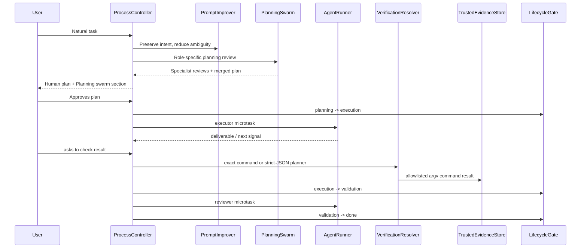

Planning swarm roles are real review roles, not labels:

| Role | Focus |
| --- | --- |
| `requirements_specialist` | ambiguity, missing requirements, acceptance criteria completeness |
| `code_research_specialist` | files/packages/APIs, implementation surface, project conventions |
| `architecture_specialist` | module boundaries, lifecycle impact, maintainability |
| `test_validation_specialist` | test coverage, exact evidence, objectively checkable criteria |
| `risk_regression_specialist` | regressions, unsafe assumptions, false completion risk |

Human output for swarm shows verdict/contribution, finding count, proposal count, top finding and proposed changes when present. It must not be a plain restatement of the user task.

### Verification And Evidence

The user must not type exact verification commands in the happy path. The app resolves verification from approved task state:

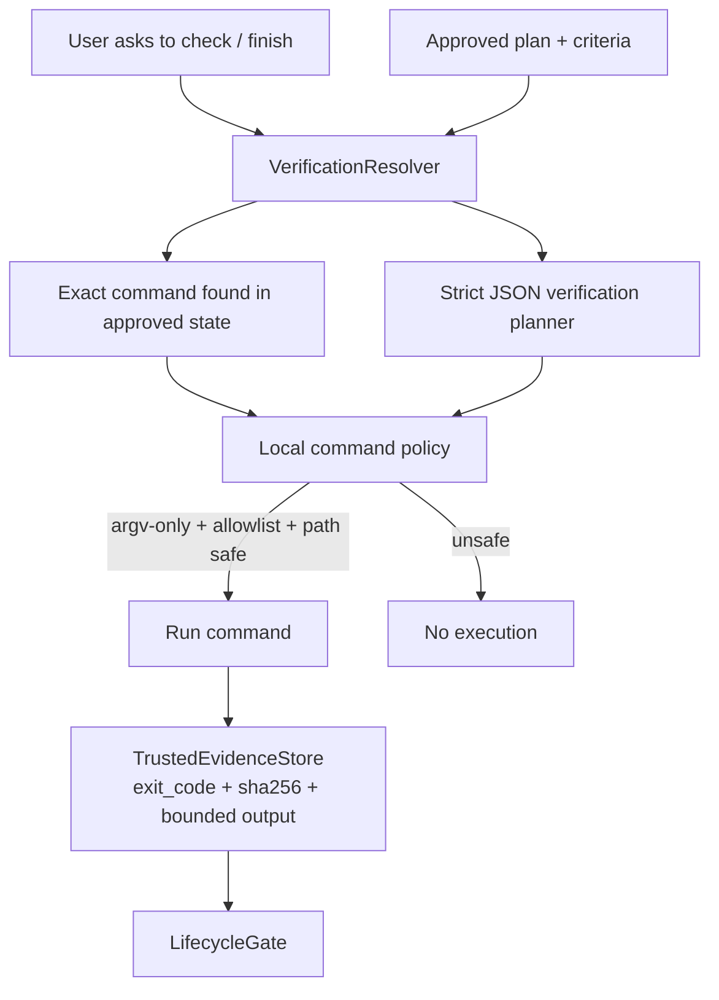

Important constraints:

- no language/path heuristic like `Go package path -> go test`;
- exact command from approved state first;
- otherwise structured planner returns strict JSON `{command, confidence, reason}`;
- local parser enforces argv-only, command allowlist, safe paths and output/time bounds;
- `--verify` exists only for debug/recovery override, not primary Day 15 demo.

### Validation Model

Validation is split intentionally:

- local deterministic checks: JSON shape, enum values, IDs, secrets, path safety, command allowlist, state transition preconditions;
- LLM semantic validators: approval intent, invariant conflicts, output contract meaning, prompt equivalence, verification planning;
- final user-visible/stage schemas stay strict;
- internal helper outputs may use tolerant parsing plus semantic revalidation.

Keyword/regex matching is not allowed as final product validation for user intent, approval, readiness, acceptance or invariant meaning.

## CLI chat UX

Обычный `assistant chat` и `assistant chat --once --input <text>` выводят человекочитаемый transcript, а не raw JSON. Пользователь видит секции `Assistant`, `Planning swarm`, `Task`, `Transition`, `Evidence`, `Warnings`, `Memory proposal` и `Next`.

В planning для Day 15 дополнительно видна секция `Planning swarm`: verdict/contribution по specialist roles, количество findings/proposals и top finding/proposed change, если они есть. Это должен быть review результата планирования, а не пересказ исходной задачи.

Для Day 15 primary demo пользователь запускает `assistant chat` один раз и дальше пишет сообщения внутри этого chat session. `assistant chat --once --input ...` допустим для automation/smoke, но не является основным пользовательским demo-сценарием Day 15.

В interactive TTY headings, labels и fenced Go code blocks подсвечиваются ANSI-стилями; при redirect/non-TTY вывод остается plain text без escape-кодов, чтобы demo logs и tests читались стабильно.

`--json` остаётся машинным режимом для regression scripts, CI, audit extraction и debug. В этом режиме stdout должен быть parseable JSON, а diagnostics идут в stderr.

## Demo And Manual Testing

Подробные сценарии ручной демонстрации, включая единственный canonical live-сценарий Day 15, лежат в [docs/manual-testing-demo.md](docs/manual-testing-demo.md). Deterministic script остаётся regression smoke, не заменой live proof.

Day 15 live demo запускается одной командой из repo root и открывает обычный `assistant chat`:

```bash
export OPENROUTER_API_KEY="..."
scripts/day15-demo.sh
```

Для локальной репетиции без OpenRouter:

```bash
scripts/day15-demo.sh --fake
```

Для автоматизированной regression-проверки:

```bash
scripts/day15-demo.sh --fake --auto
```

Day 15 live proof хранится только в demo-доке, чтобы не было второго source of truth.

## День 11: память

Критерии Дня 11 закрывает система памяти. Она нужна, чтобы приложение не начинало каждый запрос с нуля и могло использовать уже принятый контекст.

Память разделена на 3 слоя:

- `short` - текущий диалог;
- `work` - требования текущей задачи;
- `long` - устойчивые предпочтения пользователя.

Архитектурно это выглядит так:

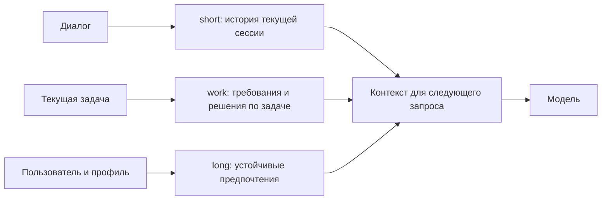

Как это работает:

- короткая история диалога сохраняется сразу как `short`;
- полезные факты для задачи попадают в `work`;
- постоянные предпочтения попадают в `long`;
- случайный шум не должен попадать в полезную память.

Классификацию делает модель, но не свободным текстом. Она должна вернуть JSON со списком записей: слой, тип записи, содержание, причина и уверенность. Приложение строго парсит этот JSON, отбрасывает неизвестные слои, блокирует секреты и дополнительно переносит требования активной задачи из `long` в `work`, если модель ошиблась с областью.

Запись важной памяти проходит через предложение:

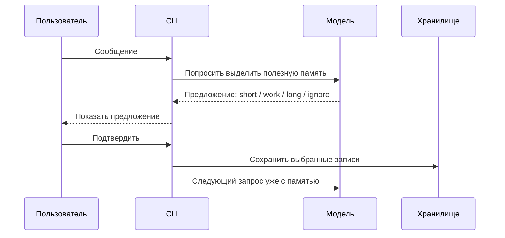

Важно: память не записывается молча. Для долгой памяти нужен видимый шаг с предложением и явное подтверждение пользователя.

Ключевой паттерн: модель может предложить, но решение о записи принимает приложение вместе с пользователем. Поэтому память остается управляемой.

Команды для проверки в CLI:

```bash
/memory propose
/memory apply --accept all
/memory short
/memory work
/memory long
```

В коде это проверяет тест:

```bash
go test ./tests -run TestDay11
```

## День 12: профили

Критерии Дня 12 закрывает система профилей. Она отделяет стиль ответа от текста задачи.

Профиль отвечает за стиль. Один и тот же вопрос может звучать по-разному, если активен другой профиль.

Примеры профилей:

- `student` - объясняет подробнее, как преподаватель;
- `senior` - отвечает короче, с фокусом на решение и риски;
- свой профиль - можно создать под нужный стиль.

Профиль хранится отдельно от диалога и добавляется в контекст запроса:

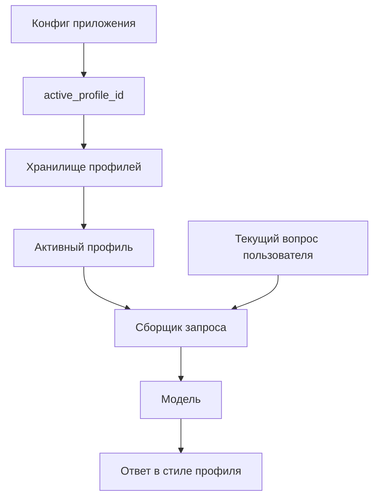

То есть пользователю не нужно каждый раз писать "объясняй как преподаватель" или "отвечай кратко". Достаточно выбрать профиль.

Что есть внутри профиля:

- язык и тон ответа;
- уровень подробности;
- формат ответа;
- ограничения, например "показывать reasoning" или "фокусироваться на рисках".

Профиль проверяет само приложение. У профиля должен быть безопасный `id`, непустое имя, стиль, формат ответа и ограничения. Секреты нельзя сохранять ни в названии, ни в настройках профиля. Модель здесь ничего не валидирует: она только получает уже выбранный профиль в составе контекста.

Ключевой паттерн: стиль не размазан по пользовательским запросам. Он хранится как отдельная настройка, проверяется при сохранении и автоматически попадает в запрос к модели.

Примеры команд:

```bash
assistant profiles list
assistant profiles show student
assistant profiles show senior
```

В интерактивном чате:

```text
/profile student
Объясни подход к Valid Parentheses.

/profile senior
Объясни подход к Valid Parentheses.
```

В коде это проверяет тест:

```bash
go test ./tests -run TestDay12
```

## День 13: задача по стадиям

Критерии Дня 13 закрывает система ведения задачи. Она нужна, чтобы работа не превращалась в свободный чат без состояния.

У задачи есть стадии:

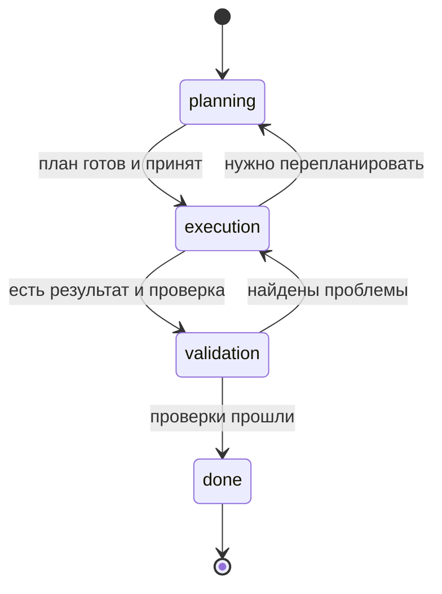

Простыми словами:

- `planning` - составляем план;
- `execution` - даем решение;
- `validation` - проверяем результат;
- `done` - задача завершена.

Приложение хранит не только стадию, но и текущий шаг, ожидаемое действие и историю. Поэтому задачу можно остановить и продолжить позже.

Главная идея: стадией владеет приложение, а не модель.

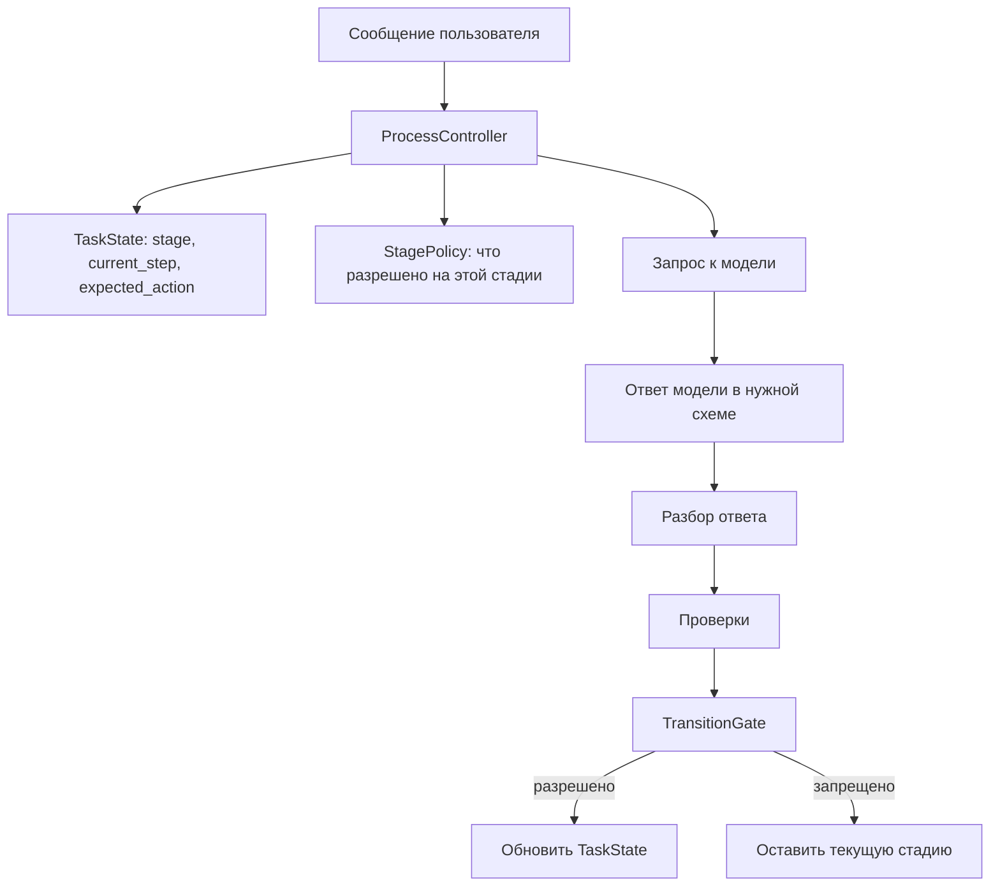

Переходы не делаются просто потому, что модель так написала. Приложение проверяет:

- ответ относится к текущей стадии;
- ответ имеет нужную структуру;
- переход разрешен;
- для завершения есть надежное app-issued подтверждение: результат allowlisted verification command, сохранённый как trusted evidence.

Здесь несколько уровней проверки:

- `ResponseParser` разбирает ответ модели как строгий JSON для текущей стадии;
- stage validators проверяют обязательные поля и простые запреты в Go-коде;
- `SemanticValidator` отдельно спрашивает модель-валидатор о смысле ответа и получает строгий JSON `pass` или `fail`;
- `TransitionGate` проверяет, можно ли менять стадию именно из текущего состояния;
- trusted verification добавляется только приложением: после approval утвержденного плана или semantic referee intent `ready_for_validation`/`ready_for_done` запускается `VerificationResolver`. Он берёт exact safe command из approved plan/acceptance criteria или вызывает structured verification planner/referee со strict JSON. Затем приложение локально проверяет argv-only command, allowlist, path safety, timeout/output cap, запускает её и сохраняет evidence. `--verify` остается explicit override/debug, не happy path.

Например, в `execution` модель может дать код в `deliverable`, но не может сама заявить "тесты прошли", если приложение не передало результат команды как trusted evidence. В `validation` переход в `done` запрещен, если нет проверок, есть blocker/high finding или отсутствует trusted evidence.

В `TaskState` хранятся:

- стадия;
- текущий шаг;
- завершенные шаги;
- ожидаемое действие;
- критерии готовности;
- план;
- история изменений.

Pause/resume:

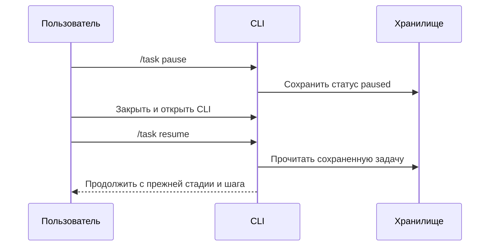

После `resume` приложение восстанавливает задачу из сохраненного состояния и продолжает с того же места.

Ключевой паттерн: модель помогает с содержанием, но переходы между стадиями проходят через проверяемые правила приложения.

В коде это проверяет тест:

```bash
go test ./tests -run TestDay13
```

## День 14: постоянные правила

Критерии Дня 14 закрывает система постоянных правил.

В коде они называются `invariants`. Проще говоря, это правила, которые приложение обязано соблюдать всегда.

Пример правила:

```text
MVP написан на Go + Cobra.
Не предлагать переписать P0 на Python, Node или Rust.
```

Правила хранятся отдельно от диалога и задачи:

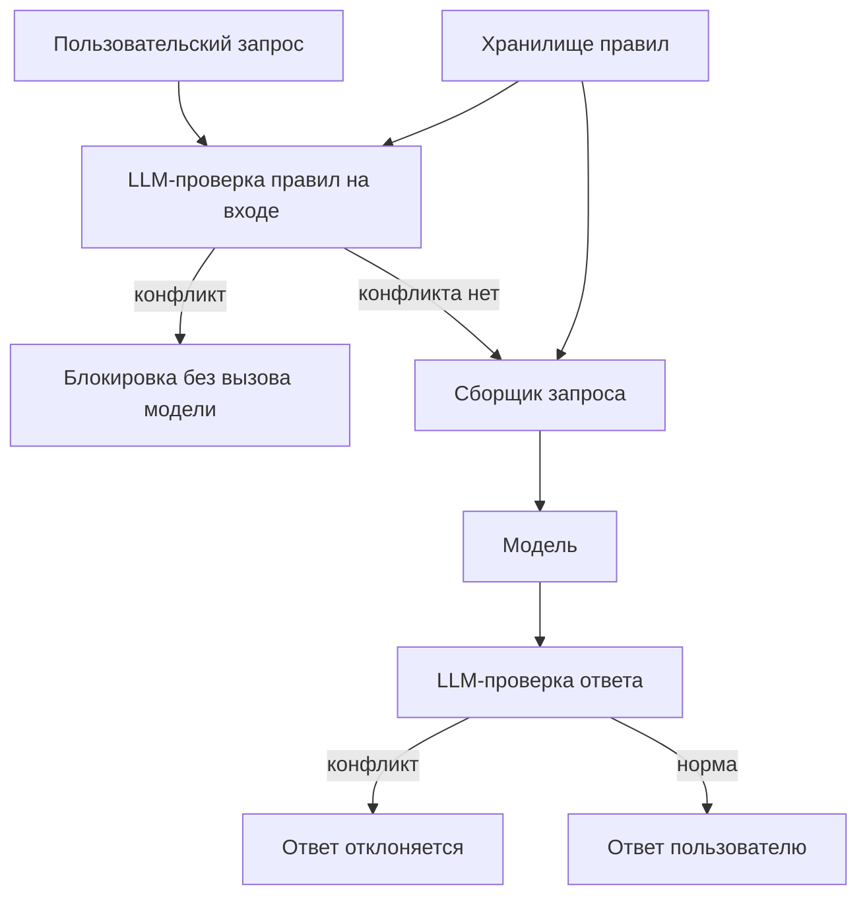

Важно: конфликтный запрос блокируется до основного chat-запроса к модели. Перед этим приложение может вызвать отдельный LLM-валидатор правил. Например, если пользователь просит переписать Go MVP на Python, приложение вернет ошибку правила и не отправит этот запрос в обычный chat flow.

После отказа обычный безопасный запрос продолжает работать. Отказ не ломает текущую задачу и не портит состояние.

Что хранится в правиле:

- `id` - имя правила;
- `scope` - область, например `stack`, `memory`, `security`;
- `content` - человеческое описание правила;
- `severity` - насколько строго правило;
- `forbidden_terms` - примеры и fallback-сигналы для правила.

Валидация правил сделана через отдельный LLM-вызов со строгим JSON-ответом. Этот вызов работает как судья: получает текст, список активных правил и возвращает список нарушений. `forbidden_terms` остаются подсказками и fallback-сигналами, но не являются основным способом понять смысл запроса. Поэтому вопрос "почему нельзя переписать MVP на Python?" можно разрешить, а просьбу "перепиши MVP на Python" заблокировать.

Если найден конфликт на входе, обычный chat provider не вызывается. Если конфликт появился в ответе модели, ответ отклоняется до сохранения в память.

Ключевой паттерн: важные ограничения живут не в памяти и не в профиле. Они хранятся как отдельная политика, которую приложение проверяет до и после обращения к модели.

Примеры команд:

```bash
assistant invariants list --json
assistant invariants add algorithm.no_bruteforce --kind quality --content "For stock-profit tasks, do not propose brute-force O(n^2); use one-pass O(n)." --forbid "O(n^2)" --forbid "brute force"
```

В коде это проверяет тест:

```bash
go test ./tests -run TestDay14
```

## День 15: контролируемый lifecycle

День 15 превращает task FSM из набора управляемых команд в автономный пользовательский flow. Пользователь пишет цель и подтверждает решения на уровне продукта, а приложение само создает задачу, улучшает prompt, собирает план, запускает исполнение, принимает evidence, проверяет результат и меняет `TaskState`.

Главное правило: LLM не владеет lifecycle. Она может предложить план, deliverable, findings или `next_signal`, но `stage`, `current_step`, `expected_action`, `validation_status` и `done` меняет только Go-код после проверок.

Архитектурно Day 15 добавляет шесть компонентов:

- `PromptImprover` - уточняет task prompt перед stage-specific вызовом, не меняя исходную цель пользователя;
- `PlanningSwarm` - собирает role-specific specialist reviews и один финальный merged plan;
- `AgentRunner` - запускает role-scoped microtask agents для execution и review;
- `VerificationResolver` - получает exact verification command из approved task state или strict-JSON verification planner, но не делает language/path inference в application code;
- `TrustedEvidenceStore` - сохраняет app-issued evidence от auto verification или explicit `--verify`, с digest и bounded summary;
- `LifecycleGate` - решает, можно ли перейти между стадиями.

Компоненты связаны так:

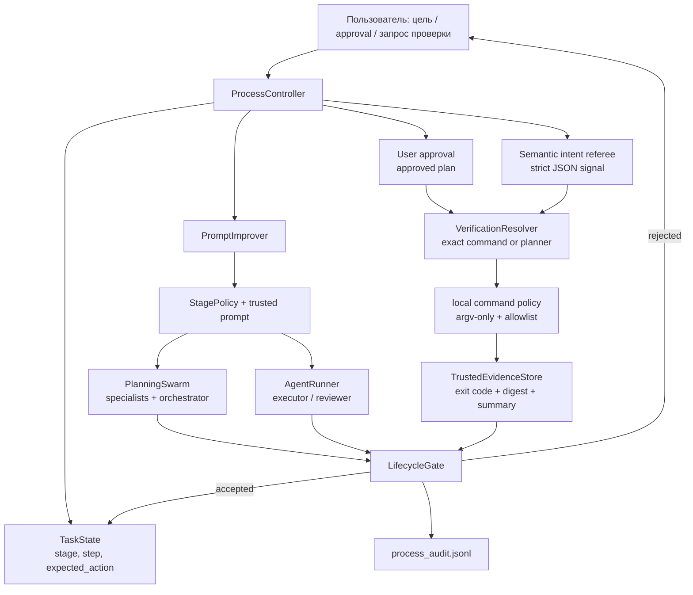

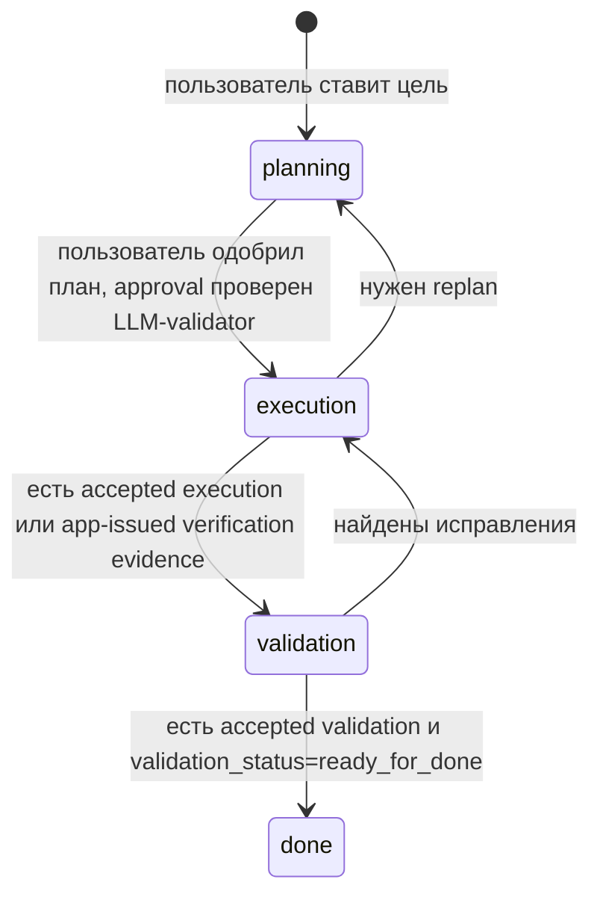

Пользовательский сценарий остается chat-driven:

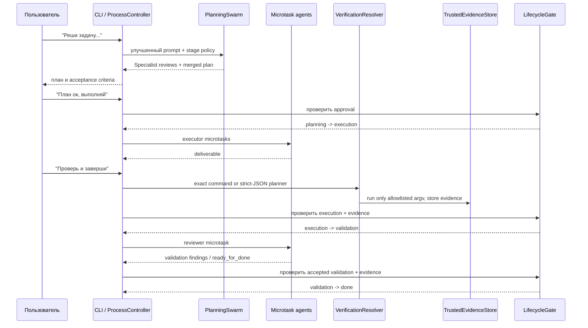

Lifecycle gate закрывает конкретные переходы:

- `planning -> execution` требует готовый план, acceptance criteria и отдельную запись approval validation;
- `execution -> validation` требует accepted execution output или criteria-matched trusted evidence;
- `validation -> done` требует accepted validation record, `validation_status=ready_for_done` и trusted evidence, если критерии требуют tests/verification;
- `execution -> planning` разрешен только для replan, когда план или критерии оказались недостаточными;
- `validation -> execution` разрешен, когда reviewer нашел blocker/high issues.

Что это меняет по сравнению с Day 13:

- раньше `/task move`, `/task step`, `/task expect` могли показать FSM механически;
- теперь эти команды считаются debug/recovery/test helpers, а не пользовательским happy path;
- основной acceptance доказывает, что пользователь работает через chat, а приложение автономно рулит state;
- `done` нельзя получить словами модели вроде "тесты прошли": нужен app-issued evidence;
- audit должен показывать prompt improvement, planning swarm, approval validation, executor/reviewer roles и lifecycle transitions.

Ручной сценарий для демо описан в [docs/manual-testing-demo.md](docs/manual-testing-demo.md); команды запуска перечислены выше в разделе `Demo And Manual Testing`. Day 15 live proof хранится только в demo-доке, чтобы не было второго source of truth.

## Как собрать и запустить

Сборка CLI:

```bash
export GOCACHE="${GOCACHE:-/private/tmp/coding_writer_gocache}"
mkdir -p .assistant/bin
go build -o .assistant/bin/assistant ./cmd/assistant
export ASSISTANT_BIN="$PWD/.assistant/bin/assistant"
```

Добавить бинарник в `PATH` для текущего терминала:

```bash
export PATH="$PWD/.assistant/bin:$PATH"
```

Инициализация:

```bash
"$ASSISTANT_BIN" init --model "$ASSISTANT_MODEL"
```

Интерактивный чат:

```bash
"$ASSISTANT_BIN" chat
```

Для отдельной демонстрации удобно задавать отдельную папку состояния:

```bash
export ASSISTANT_STORAGE_DIR="$PWD/.assistant/storage/demo"
```

Так разные прогоны не смешивают память, профили, задачи и правила.

## Как проверить

Проверить acceptance-регрессию Days 11-14:

```bash
go test ./tests -run 'TestDay11|TestDay12|TestDay13|TestDay14'
```

Проверить deterministic Day 15 regression smoke:

```bash
bash scripts/manual-day15-user-flow.sh
```

Live Day 15 proof требует `OPENROUTER_API_KEY`, `ASSISTANT_MODEL=google/gemini-3.1-flash-lite` и выполняется по [docs/manual-testing-demo.md](docs/manual-testing-demo.md).

Проверить весь проект:

```bash
go test ./...
```

## Где читать дальше

- [docs/manual-testing-demo.md](docs/manual-testing-demo.md) - подробный сценарий демонстрации дней 11-15;
- [docs/prd.md](docs/prd.md) - описание продукта;
- [docs/frd.md](docs/frd.md) - функциональные требования;
- [docs/architect.md](docs/architect.md) - архитектурные заметки.
