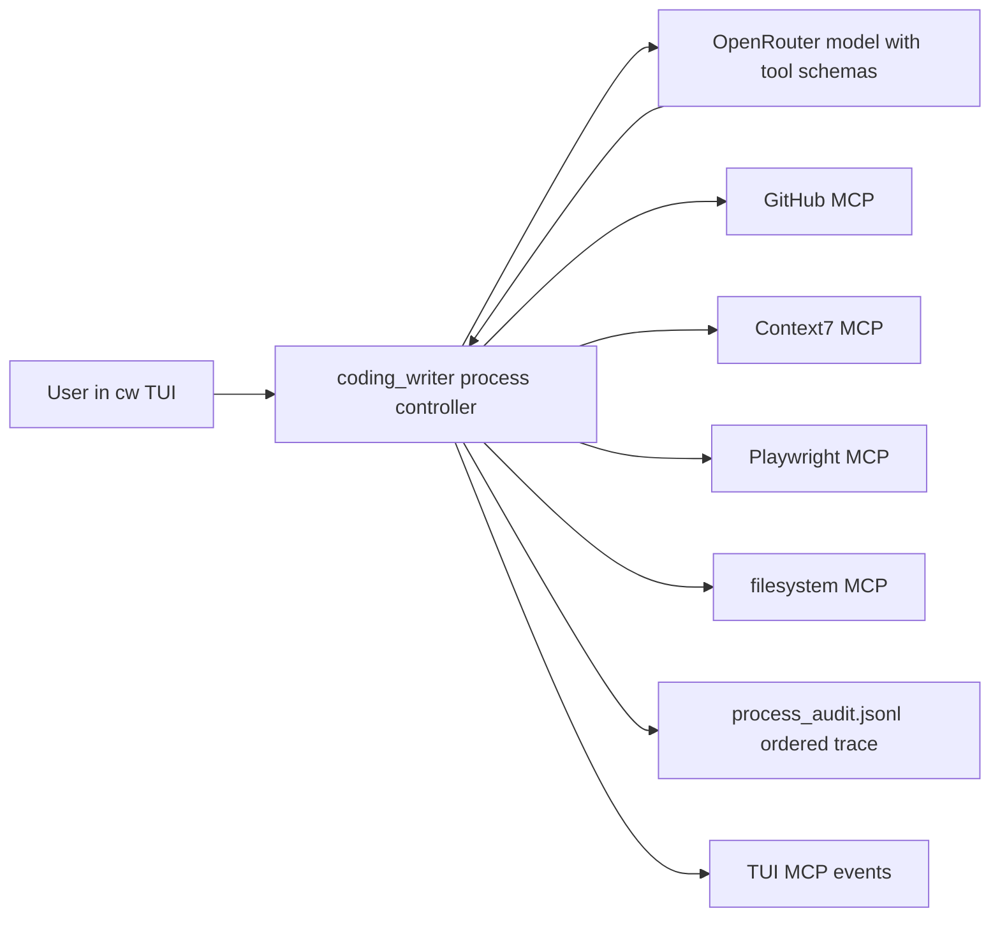

# Day 20 — Multi-MCP Orchestration

## System Shape

Day 20 proves that `coding_writer` can orchestrate several existing MCP servers in one normal `cw` TUI conversation.

The agent does not call a hardcoded pipeline command. The app discovers allowlisted MCP tools, exposes them to the active model as provider tool schemas, executes requested calls in order, and records app-issued audit evidence for every call/result.



## MCP Policy

Each configured MCP tool has a permission class and approval policy:

- `permission=read`: read-only data lookup.
- `permission=browser`: browser/page inspection or browser state actions explicitly accepted for the demo.
- `permission=write`: file/system mutation; requires an explicit allow policy and `--path-prefix`.
- `approval=auto`: app may execute the tool after the user has configured this allow policy.
- `approval=ask`: tool is visible but execution returns an approval-required tool result.
- `approval=deny`: tool is hidden from model tool schemas.

Legacy `--allow-tool ... --auto-approve --read-only` remains compatible and maps to `permission=read approval=auto`.

## Demo Servers

The final Day 20 flow uses popular existing MCP servers:

- GitHub MCP: official `ghcr.io/github/github-mcp-server` image, read-only mode.
- Context7 MCP: `@upstash/context7-mcp`.
- Playwright MCP: `@playwright/mcp`.
- filesystem MCP: `@modelcontextprotocol/server-filesystem`.

GitHub auth must be passed through environment only. Do not store tokens in repo or app config. The official GitHub MCP server exits during tool discovery when `GITHUB_PERSONAL_ACCESS_TOKEN` is missing.

## TUI Setup

Run from the repo root:

```bash
cd /Users/nikita/code/coding_writer
export ASSISTANT_STORAGE_DIR=/Users/nikita/code/coding_writer/.assistant/day20-manual
export ASSISTANT_MODEL=google/gemini-3.1-flash-lite
test -n "$GITHUB_PERSONAL_ACCESS_TOKEN" && echo "GITHUB token present"
cw init --model "$ASSISTANT_MODEL"
cw
```

Install the official GitHub MCP server once if needed. The preset below uses this
repo-local binary so the demo does not require Docker:

```bash
mkdir -p .codingwriter/mcp-bin
GOBIN=/Users/nikita/code/coding_writer/.codingwriter/mcp-bin \
  go install github.com/github/github-mcp-server/cmd/github-mcp-server@latest
```

Inside the same `cw` TUI session, use the generic shorthand instead of raw
transport commands:

```text
/mcp connect github bin:.codingwriter/mcp-bin/github-mcp-server --env GITHUB_PERSONAL_ACCESS_TOKEN --allow search_repositories -- stdio --read-only --toolsets repos
/mcp connect context7 npm:@upstash/context7-mcp --allow resolve-library-id,get-library-docs
/mcp connect playwright npm:@playwright/mcp --allow browser_navigate:browser,browser_snapshot:browser -- --headless --isolated --output-dir .data/day20/playwright
/mcp connect filesystem npm:@modelcontextprotocol/server-filesystem --allow write_file:write:auto:.data/day20 -- .data/day20
/mcp
```

`/mcp connect` is not Day-20-specific:

- `npm:<package>` expands to `npx -y <package>`.
- `bin:<path>` runs a local binary.
- `cmd:<command>` runs a command from `PATH`.
- server-specific args go after `--`.
- compact allow specs use `tool[:permission[:approval[:path-prefix]]]`.

For an arbitrary new MCP server, use a discover-then-allow flow when tool names
or permissions are unknown:

```text
/mcp connect docs npm:@vendor/example-mcp
/mcp tools docs
/mcp allow docs search --permission read --approval auto
```

For this exact demo, `/mcp preset day20` is also available as a one-command
shortcut. Raw `/mcp add` remains available for custom/debug setup, but is not the
normal product path.

Optional discovery checks in TUI:

```text
/mcp
/mcp tools github
/mcp tools context7
/mcp tools playwright
/mcp tools filesystem
```

## User Scenario

Send a normal text message in the same TUI:

```text
Собери Day 20 отчет о популярных MCP-серверах для coding agent.

Нужны 4 типа evidence: репозитории, документация, браузерная проверка страницы проекта и сохраненный markdown-файл .data/day20/multi-mcp-report.md.

В конце покажи путь к файлу и фактический порядок вызванных инструментов.
```

Expected ordered tool domains:

1. `github__search_repositories`
2. `context7__resolve-library-id`
3. `context7__get-library-docs`
4. `playwright__browser_navigate`
5. `playwright__browser_snapshot`
6. `filesystem__write_file`

## Acceptance Evidence

The final proof is valid only when all are true:

- TUI timeline shows MCP tool call/result events.
- `process_audit.jsonl` contains ordered `mcp_tool_call` and `mcp_tool_result` entries with `ordinal=`, `server=`, `tool=`, and `status=`.
- `.data/day20/multi-mcp-report.md` exists and is non-empty.
- The final assistant answer includes the report path and ordered MCP trace.
- `go test ./internal/mcp ./internal/cli ./internal/process ./internal/tui` passes.
- `go test ./...` passes.
